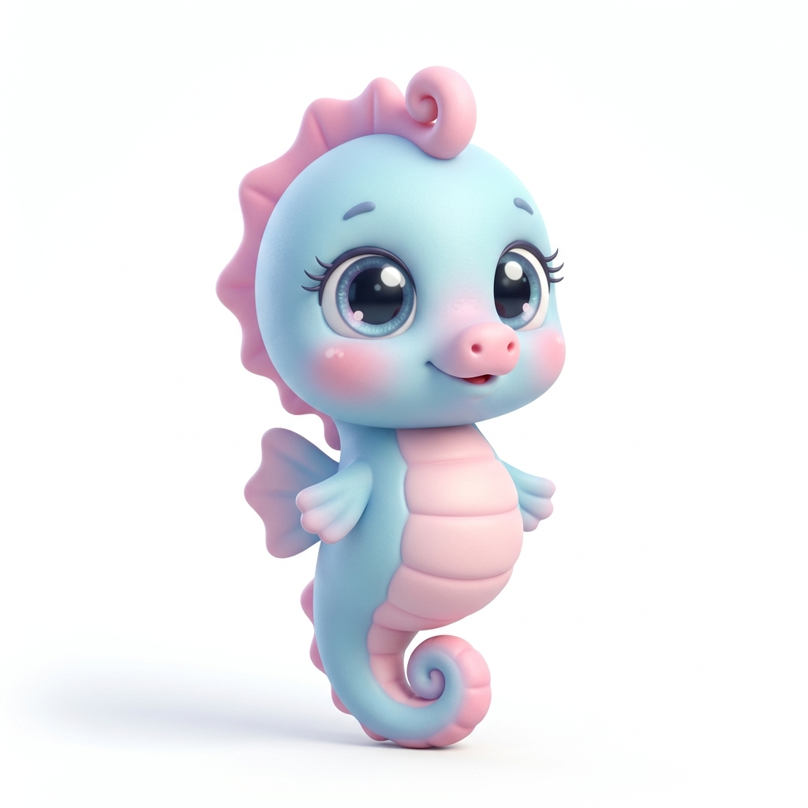
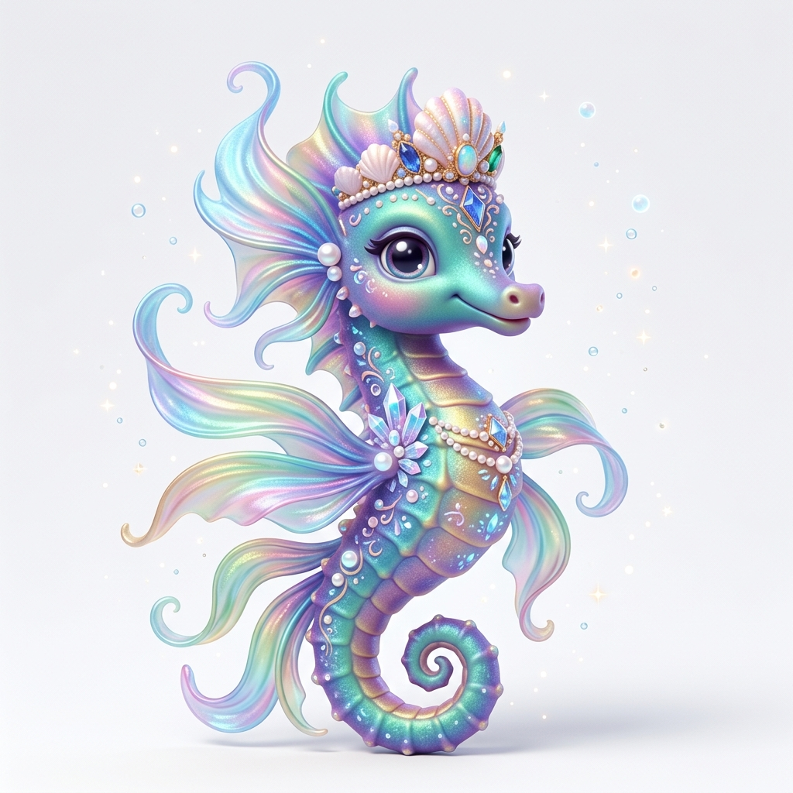

# 班级宠物园：海马宠物 1-8 级生图风格解析与 Prompt 指南

为了确保新设计的**海马 (Seahorse)** 宠物能够完美融入班级宠物园现有的超萌视觉风格中，我们对现有宠物图鉴的美术特征进行了深度剖析，并为您提供全套 1-8 级的生图方案。

---

## 🎨 核心美术风格拆解

班级宠物园的已有宠物具有极其统一的高水准美术表现，其风格特征可以归纳为以下几大维度：

*   **视觉分类**：**3D Q 版卡通角色插画 (3D Chibi Cartoon Character)**。
*   **材质质感**：具备皮克斯/迪士尼 (Pixar/Disney) 动画风格的**软粘土、搪胶、软胶玩具 (Soft clay, vinyl, smooth resin toy)** 质感。角色身体线条圆润，高光饱满。
*   **构图视角**：**正面视角、全身立体站立/坐姿 (Full body, front view, standing/sitting pose)**，正对镜头，带着可爱的拟人化微笑。
*   **面部特征**：大头小身（Q版比例），最核心的是拥有一双**水汪汪的超级大眼睛 (Extremely big shiny watery eyes)**，眼神澄澈，瞳孔带有精致的多点白色反光。
*   **光影背景**：采用**体积感三点光源 (Volumetric lighting, three-point lighting)**，带有明亮的全局照明与边缘高光；背景统一为**极简白色/浅灰纯色背景 (Pure white background)**，角色脚下有自然的柔和阴影 (Soft contact shadow)。
*   **色彩体系**：高饱和度、明亮欢快的**糖果色与柔和渐变 (Vibrant candy colors, pastel gradients)**。

---

## 🎠 高保真海马生成效果预览

我们使用生图工具为您预先生成了 **Lv.1 (初生)** 与 **Lv.8 (传说满级)** 阶段的海马图片。这两张原画已作为项目文档资产收录在 `docs/images/seahorse/` 目录中：

````carousel

<!-- slide -->

````

---

## 🐚 1-8 级海马成长 Prompt 方案一览

以下是为**谷歌生图工具 (Imagen 3 / Gemini)** 专门优化的高精细度英文 Prompt，可直接复制使用。提示词中已经完美锁定了现有的 3D 黏土卡通风格特征，并**强力限制了 1:1 正方形纵横比与全身防裁切构图**以满足宠物系统的图片上传要求：

### Lv.1 初生 (Newborn)
> **成长形态特征**：刚出生的小小海马，身体娇小微胖，眼神懵懂，奶呼呼的粉蓝与粉红渐变，几乎没有任何配饰，极致的单纯和可爱。

```text
A high-quality 3D chibi baby seahorse cartoon character, 1:1 square aspect ratio, centered square composition, Pixar Disney style, front view, standing pose, very cute, extremely big watery eyes, soft global illumination, soft clay vinyl material texture, pastel blue and pink candy colors, pure white background, soft contact shadow underneath, volumetric lighting, full body completely in frame, head and tail fully visible, no cropping, 8k resolution
```

---

### Lv.2 成长 (Growing)
> **成长形态特征**：稍微长大了一些，身体线条变长了一点，头顶的波浪小鳍开始舒展，呈现出好奇活泼的快乐表情。

```text
A high-quality 3D chibi young seahorse cartoon character, 1:1 square aspect ratio, centered square composition, Pixar Disney style, front view, standing pose, cheerful expression, slightly larger watery eyes, soft global illumination, soft clay vinyl material texture, cute small wave-like head fins, candy blue and orange colors, pure white background, soft contact shadow underneath, volumetric lighting, full body completely in frame, head and tail fully visible, no cropping, 8k resolution
```

---

### Lv.3 优秀 (Excellent)
> **成长形态特征**：身体变得强健，尾部微微卷曲，头顶多了一朵可爱的小红海草发卡，透露出优秀且自信的气质。

```text
A high-quality 3D chibi happy seahorse cartoon character, 1:1 square aspect ratio, centered square composition, Pixar Disney style, front view, standing pose, smiling eyes, wearing a tiny red seaweed hairclip on its head, elegant curved tail, soft global illumination, soft clay vinyl material texture, bright turquoise and pastel yellow candy colors, pure white background, soft contact shadow underneath, volumetric lighting, full body completely in frame, head and tail fully visible, no cropping, 8k resolution
```

---

### Lv.4 进阶 (Advanced)
> **成长形态特征**：背鳍和腹部长出精致的水滴纹路，戴上了一个小小的可爱贝壳项链，像一个熟练在大海中穿梭的小水手。

```text
A high-quality 3D chibi confident adventurer seahorse, 1:1 square aspect ratio, centered square composition, Pixar Disney style, front view, standing pose, wearing a tiny cute seashell necklace, distinct drop-pattern fins, soft global illumination, soft clay vinyl material texture, vibrant coral pink and yellow candy colors, pure white background, soft contact shadow underneath, volumetric lighting, full body completely in frame, head and tail fully visible, no cropping, 8k resolution
```

---

### Lv.5 稀有 (Rare)
> **成长形态特征**：身体质感开始蜕变，带有微微的半透明水晶荧光，折射出极光般的糖果色调，显露出稀有的神秘本源。

```text
A high-quality 3D chibi rare glowing seahorse, 1:1 square aspect ratio, centered square composition, Pixar Disney style, front view, standing pose, slightly translucent gelatin-like crystal texture, luminous body patterns, soft global illumination, soft clay vinyl material texture, iridescent pastel aurora colors, pure white background, soft contact shadow underneath, volumetric lighting, full body completely in frame, head and tail fully visible, no cropping, 8k resolution
```

---

### Lv.6 精英 (Elite)
> **成长形态特征**：眼神带有精英的智慧，头顶和鳍部的波浪纹更加飘逸，身上开始缠绕着一圈小巧的魔法水珠泡泡，华丽且富有灵性。

```text
A high-quality 3D chibi elite magical seahorse, 1:1 square aspect ratio, centered square composition, Pixar Disney style, front view, standing pose, surrounded by a ring of glowing tiny water droplets, flowing wind-swept fins, soft global illumination, soft clay vinyl material texture, deep aqua and pastel purple candy colors, pure white background, soft contact shadow underneath, volumetric lighting, full body completely in frame, head and tail fully visible, no cropping, 8k resolution
```

---

### Lv.7 史诗 (Epic)
> **成长形态特征**：背后的尾鳍和胸鳍进化得极为飘逸动人，犹如在大海中拂过的七彩极光丝带，身体两侧长出小巧的水晶珊瑚角。

```text
A high-quality 3D chibi epic seahorse character, 1:1 square aspect ratio, centered square composition, majestic and elegant, Pixar Disney style, front view, standing pose, possessing long flowing fins like iridescent ribbons, tiny crystal coral horns on temples, soft global illumination, soft clay vinyl material texture, vibrant candy colors with pearl shimmer, pure white background, soft contact shadow underneath, volumetric lighting, full body completely in frame, head and tail fully visible, no cropping, 8k resolution
```

---

### Lv.8 传说/满级毕业 (Legendary)
> **成长形态特征**：满级毕业的终极海马皇者！头戴由天然水波珍珠与贝壳镶嵌成的华丽微型皇冠，项挂蓝宝石丝带，身侧环绕着星河般的魔法水汽与七彩泡泡，飘尾长鳍熠熠生辉。

```text
A high-quality 3D chibi legendary adult seahorse, 1:1 square aspect ratio, centered square composition, majestic and cute, Pixar Disney style, front view, standing pose, wearing a tiny shell crown, crystal and pearl decorations on its body, flowing ethereal fins like iridescent ribbons, glowing tiny bubbles surrounding it, soft global illumination, soft clay vinyl material texture, vibrant candy colors, pure white background, soft contact shadow underneath, volumetric lighting, full body completely in frame, head and tail fully visible, no cropping, 8k resolution
```
